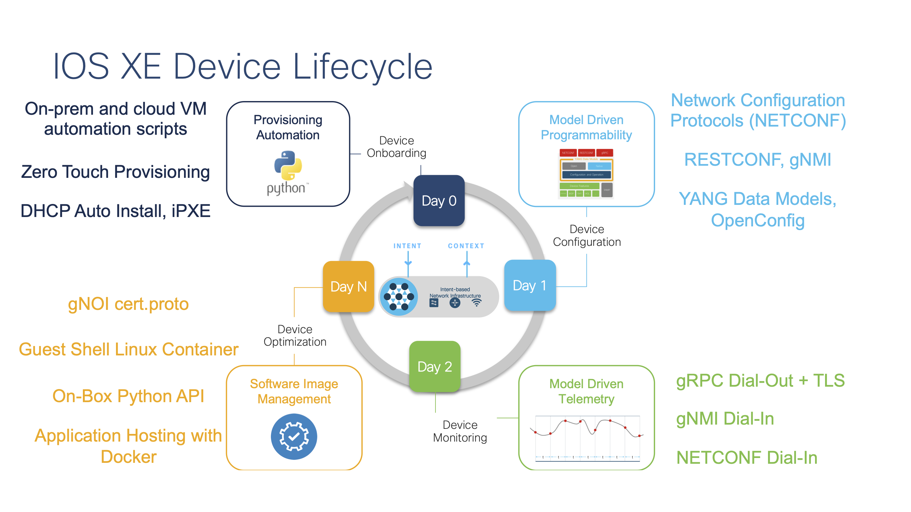
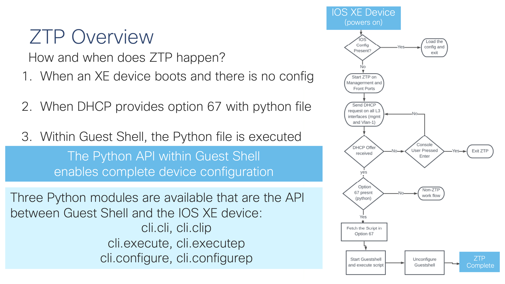

# Introduction to ZTP

The Zero Touch Provision solution fits within the **Day 0 - Device Onboarding** part of the IOS XE device lifecycle. It's function is to onboard network devices to the network. There are components from **Day N - Device Optimzation** specifically the Python API and the Gueset Shell Linux Container that are leveraged as part of the ZTP feature. There are other labs that focus more on Guest Shell and the Python API, as well as on the Day 1 and Day 2 features that are not covered as part of this lab.




## What is ZTP ?

Zero Touch Provision, or ZTP, is part of the **Day 0** device programmability ecosystem which enables network operators to provision network device more programmatically. Using a combiation of DHCP, Python, and the Linux Guest Shell container, the ZTP feature is used to fully configure the device automatically during it's initial boot.

When a device that supports Zero-Touch Provisioning boots up, and does not find the startup configuration (during initial installation), the device enters the Zero-Touch Provisioning mode. 

The device searches for an IP from a DHCP server and bootstraps itself by enabling the Guest Shell Linux container. The device then obtains the IP address or URL of the HTTP or TFTP server, and downloads a Python script from the server to configure the device.



## Prerequisites

 - A DHCP server with option 67 specifying the Python file
 - Webserver or TFTP server to provide the Python file
 - The Python file for ZTP

## Getting started with ZTP 
### DHCP
A DHCP server is required for ZTP, as this is how the device learns about where to find the Python configuration file from. In this case, the DHCP server is the open source **ISC DHCPd** and the configuration file is at **/etc/dhcp/dhcpd.conf** in the Linux developer box. The **option bootfile-name** is also known as  **option 67** and it specifies the configuration file is **ztp.py**

1. Enable DHCP Server 
2. Configure option 67 
3. Restart DHCP server

⚠️ Check the status of the DHCP configuration file, process, and log file with the following commands for ISC DHCP server. An example DHCP config is also provided [here](https://github.com/jeremycohoe/c9300-ztp/blob/master/etc_dhcp_dhcpd.conf)

``` cmd
cat /etc/dhcp/dhcpd.conf | grep bootfile-name
# Example for DHCP Option 67 bootfile-name with HTTP:
option bootfile-name "http://192.168.69.1/ztp.py";

ps xa |grep dhcpd

tail -F /var/log/dhcpd.log &
```

In the above example the Python file for ZTP is called **ztp.py** and is hosted at the webserver root directory which is set within the Apache webserver configuration.

### Webserver 

ZTP accesses the python configuration file from HTTP or TFTP. In the example HTTP is used. 

⚠️ Check that the **Apache HTTPD** server is running with the following commands, this will follow the log file from the webserver so you will see when the file is accessed.

**ps xa | grep httpd**

**tail -F /var/log/httpd/access_log &**


### Python file for ZTP

The ZTP.py file is located in the websrver root directory at **/var/www/html/** and is downloaded by the IOS XE device during the ZTP workflow. 

⚠️ Check the ZTP.py file is saved in the webserver root directory and has the necessary configuration for the IOS XE device

**cat /var/www/html/ztp.py**

```
print "\n\n *** Sample ZTP Day0 Python Script *** \n\n"
# Importing cli module
import cli

print "Configure vlan interface, gateway, aaa, and enable netconf-yang\n\n"
cli.configurep(["int vlan 1", "ip address 10.5.123.27 255.255.255.0", "no shut", "end"])
```


## ZTP.py examples 

Included in the repository are several example ZTP.py files. From basic example with just a few CLI's to an advanced use case where model number and serial numbers are evaluated as variables.

 - ztp-simple.py - Simple ZTP file to provision the IP and AAA and enable the API
 - ztp-debug.py - Debug commands for additional output and troubleshooting
 - ztp-advanced.py - Avanced use case where the software is upgraded and configuration file is applied


## Resources
 - Reserve the [ZTP sandbox](https://devnetsandbox.cisco.com/RM/Topology)
 - Review the [ZTP Learning Lab](https://developer.cisco.com/learning/lab/LL-ZTP-XE/step/1)
 - Demo recording available on [YouTube](https://youtu.be/J5pp4ts13F4)

