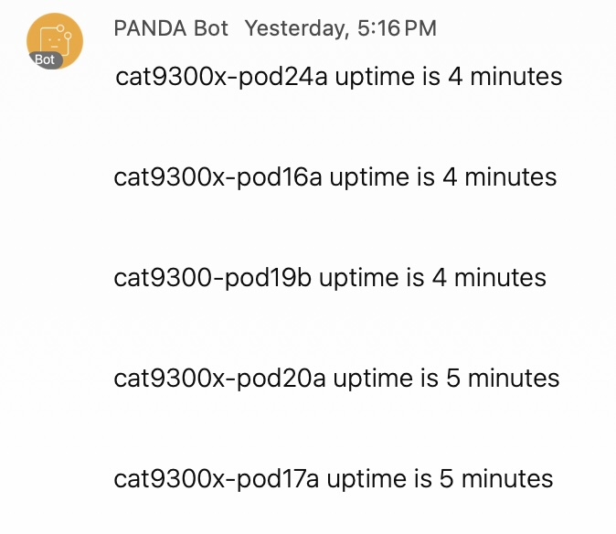

Some stuff here to describe how request library can be used at Day 0 ZTP to send a notification.

There is some room for improvement here...

# Required python wheel files

```
certifi-2023.11.17-py3-none-any.whl
charset_normalizer-2.0.12-py3-none-any.whl
idna-3.6-py3-none-any.whl
requests-2.27.1-py2.py3-none-any.whl
urllib3-1.26.18-py2.py3-none-any.whl
```

# Example python ztp-simple-notification.py

```
print ("*** Starting notification on device! ***")
print ("** delete any old files **")
cli_command = "delete /force flash:guest-share/wxt.*"
cli.executep(cli_command)
print ("** copy files **")
cli_command = "copy http://128.107.223.248/wxt.tgz flash:guest-share/"
cli.executep(cli_command)
cli_command = "copy http://128.107.223.248/wxt.sh  flash:guest-share/"
cli.executep(cli_command)
print ("** create alias exec **")
# Create alias notification to run the EEM applet with:
cli.configurep(["alias exec wxtnotification event manager run notification", "exit"])
# Enable notification EEM applet and script
print ("*** eem applet ***")
eem_notification_commands = ['no event manager applet notification',
                'event manager applet notification',
                'event none maxrun 600',
                'action 0001 cli command "enable"',
                'action 0002 cli command "guestshell enable"',
                'action 0030 cli command "guestshell run /usr/bin/bash /bootflash/guest-share/wxt.sh"'
                ]
results = configure(eem_notification_commands)
print ("*** call that eem applet ***")
cli_command = "wxtnotification"
cli.executep(cli_command)
print ("*** Successfully configured notification on device! ***")
```

# Example wxt.sh

```
#!/bin/bash

mkdir -p ~/wxt/
cd /home/guestshell/wxt/

/usr/bin/tar xvfz /bootflash/guest-share/wxt.tgz -C /home/guestshell/wxt/

sudo /usr/bin/pip3 install /home/guestshell/wxt/charset_normalizer-2.0.12-py3-none-any.whl
sudo /usr/bin/pip3 install /home/guestshell/wxt/idna-3.6-py3-none-any.whl
sudo /usr/bin/pip3 install /home/guestshell/wxt/urllib3-1.26.18-py2.py3-none-any.whl
sudo /usr/bin/pip3 install /home/guestshell/wxt/certifi-2023.11.17-py3-none-any.whl
sudo /usr/bin/pip3 install /home/guestshell/wxt/requests-2.27.1-py2.py3-none-any.whl

echo "Sending notification"
/usr/bin/python3 /home/guestshell/wxt/notification.py
```

# Example notification.py

```
import requests
import socket
from cli import configure, cli
import cli

url = "https://api.ciscospark.com/v1/messages"

room_id = "your_room_id_here_ok"
bearer = "a_really_long_string_goes_in_here_ok_u_gotta_go_get_it_first"

#message = "This is a test message from the PANDA SourceVM POD 21 yo yo yo"
#message = "C9300: a switch {}".format(socket.gethostname()) + " has rebooted"
#print(socket.gethostname())
#message = "C9300: a switch {}".format(socket.gethostname()) + " has rebooted"

hostname = cli.execute('show version | i uptime')
print(hostname)

payload = {
    "roomId": room_id,
    "text": hostname
    }

headers = {
    "Authorization": "Bearer %s " % bearer
    }

response = requests.post(url, headers=headers, data = payload).json()
print(response)
```

# Example notification in Webex Teams

